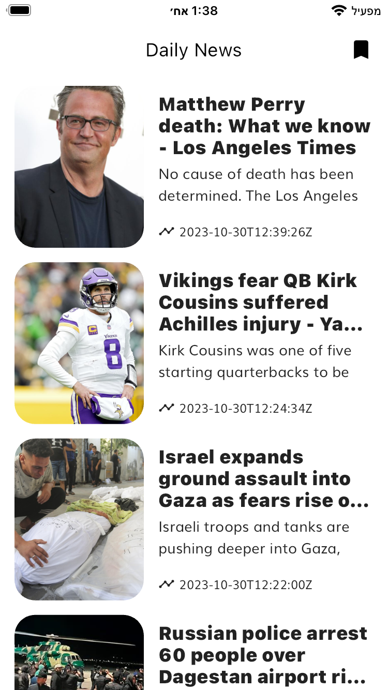
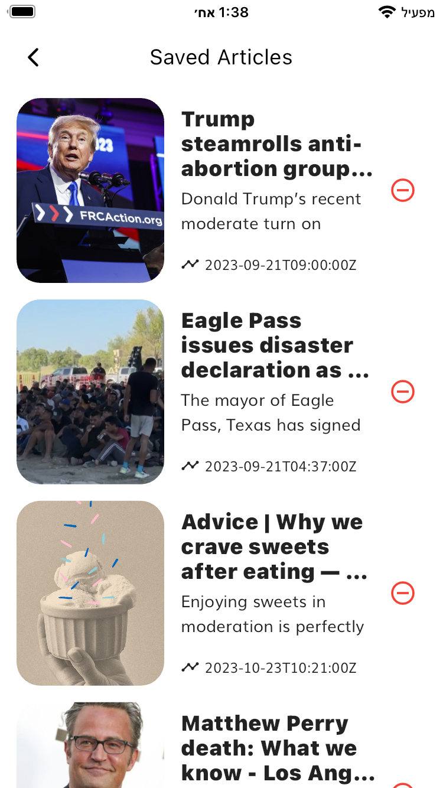

# Daily News App

Daily News App is a simple news application developed for the purpose of learning clean code principles and basic UI design. This project demonstrates the implementation of clean code practices and follows a well-organized folder structure. The app incorporates several functionalities and skills, including data fetching using Retrofit/Dio package, local storage of news articles using SQL (Floor package), state management with BLoC pattern, and dependency injection with GetIt.

## Features

- **API Data Fetching:** The app fetches news data from a remote API using the Retrofit/Dio package for efficient networking operations.
- **Local Storage:** News articles are saved locally using SQL database, facilitated by the Floor package. This allows users to access previously loaded articles even without an internet connection.
- **State Management:** BLoC (Business Logic Component) pattern is employed for state management, ensuring a clear separation of concerns and an organized flow of data in the app.
- **Dependency Injection:** GetIt is used for dependency injection, providing a clean and efficient way to manage the app's components and services.

  
  
  

